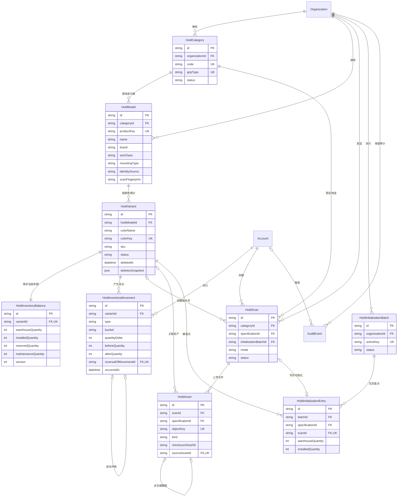
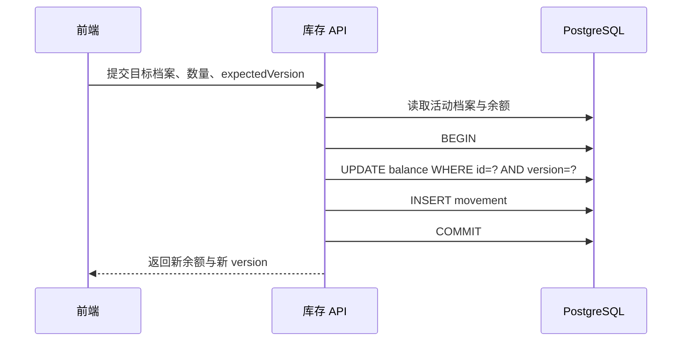
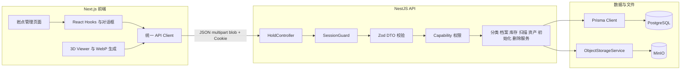

# 岩点模块设计与全栈实现详解

> 适用范围：当前 POC 的模块 2.3A / 2.3B，以 `apps/api/prisma/schema.prisma` 和 `apps/api/src/holds` 的实际代码为准。  
> 可编辑图示：[岩点模块 ER 图与系统架构图（FigJam）](https://www.figma.com/board/DrLg9FtyP05uIaOLbcI00t)

## 1. 先用一句话理解整个模块

岩点模块不是为每一颗实体岩点建一行数据，而是先建立“用途分类”，再识别“同一产品型号”，最后用“精确规格档案”聚合管理完全相同的一批岩点数量；当前数量写在余额表，每一次变化写入不可变流水表，3D 模型和照片保存在对象存储中。

核心层级如下：

```text
岩馆 Organization
└── 用途分类 HoldCategory，例如：大把手 Jug
    └── 产品型号 HoldModel，例如：某厂商、某造型、L、螺栓固定
        └── 精确档案 HoldVariant，例如：黄色、#F4D33A、SKU-001
            ├── 当前库存 HoldInventoryBalance
            ├── 库存流水 HoldInventoryMovement
            ├── 3D / 照片 HoldAsset
            └── 初始化盘点 HoldInitializationEntry
```

这解决了两个看似矛盾的需求：

- 不需要给每一颗完全相同的岩点贴独立条码，录入和换线不会过度复杂。
- 又不会只存一个粗糙的总数量；颜色、尺寸、厂商和固定方式不同的岩点仍然彼此隔离。

## 2. 业务词汇与数据库对象的对应关系

| 用户看到的词        | 代码 / 表                 | 它回答的问题                         | 是否直接存数量 |
| ------------------- | ------------------------- | ------------------------------------ | -------------- |
| 用途分类            | `HoldCategory`            | 这类岩点用来怎么抓？                 | 否             |
| 产品型号            | `HoldModel`               | 厂商、造型、尺寸、固定方式是否相同？ | 否             |
| 岩点档案 / 精确规格 | `HoldVariant`             | 颜色和 SKU 也相同吗？                | 否             |
| 当前库存            | `HoldInventoryBalance`    | 此刻仓库、墙上、预留、维护各有多少？ | 是             |
| 库存记录            | `HoldInventoryMovement`   | 数量为什么变成现在这样？             | 记录变化量     |
| 扫描草稿            | `HoldScan`                | 这次上传正在新建档案还是补充模型？   | 否             |
| 文件资产            | `HoldAsset`               | 3D、缩略图和照片在哪里？             | 否，只存元数据 |
| 初始化批次          | `HoldInitializationBatch` | 这次全馆盘点是否完成？               | 汇总明细       |
| 初始化明细          | `HoldInitializationEntry` | 某档案现场清点了多少？               | 存盘点快照     |

### 2.1 “同一型号”和“同一档案”如何判断

当前代码用两个归一键表达业务身份：

```text
productKey = 生产商 | 产品名称 | 尺寸等级 | 固定方式 | 宽 | 高 | 深
colorKey   = 颜色名称 | RGB Hex
```

每一段都会先去除首尾空格、合并连续空格并转为小写。数据库唯一约束保证：

- 同一用途分类下，`productKey` 不能重复。
- 同一产品型号下，活动档案的 `colorKey` 不能重复。

因此，当前“可批量计数的最小单位”是：

```text
用途 + 生产商 + 产品名称/造型 + 尺寸 + 固定方式 + 外形尺寸 + 颜色
```

`SKU` 是辅助检索信息，当前没有参与唯一身份计算。这是合理的 POC 选择，因为现实中 SKU 可能缺失或填写不一致；如果以后确定某厂商 SKU 可靠，可以增加“同厂商活动 SKU 唯一”的约束，但不应直接替换现有身份键。

## 3. 数据库 ER 图

下面是为了学习而保留主要字段的 ER 图。完整字段仍以 Prisma Schema 为准。



### 3.1 为什么库存要拆成“余额 + 流水”

只用一张表保存数量，读取快，但无法可靠回答“谁在什么时候为什么把 10 改成 7”。只保存流水，审计完整，但每次显示当前库存都需要对大量记录求和。

本项目采用两张表：

- `HoldInventoryBalance` 是读取模型：页面快速读取当前值。
- `HoldInventoryMovement` 是审计模型：追加新流水，不修改旧事实。

它们必须在同一个数据库事务中更新。这样既有读取性能，又能追溯历史。这种模式可以迁移到积分、钱包余额、票券库存、会员次数和设备耗材等业务。

### 3.2 四个库存分区不是四种岩点

| 分区          | 含义               | 典型变化                 |
| ------------- | ------------------ | ------------------------ |
| `WAREHOUSE`   | 仓库可用           | 到货、拆墙入库、领用上墙 |
| `INSTALLED`   | 已上墙             | 定线安装、拆线下墙       |
| `RESERVED`    | 换线预留           | 为即将执行的换线锁定数量 |
| `MAINTENANCE` | 清洗、维修或待检查 | 维护入、维护完成         |

当前 POC 已完整支持到货、校准、初始化、撤销和删除清零。`INSTALL / REMOVE / RESERVE / RELEASE / MAINTENANCE_*` 已在枚举中预留，但墙面和定线模块尚未接入对应 API。

## 4. 数据完整性：不能只依赖前端

当前数据库已经用多层约束保护数据：

### 4.1 外键

外键普遍使用 `ON DELETE RESTRICT`。只要库存、流水、扫描或资产仍引用档案，数据库就不会允许误级联删除历史。

### 4.2 唯一约束

- `(organizationId, code)`：同一岩馆分类编号唯一。
- `(organizationId, gripType)`：同一岩馆一个抓握用途只有一个分类。
- `(categoryId, productKey)`：同用途下不重复创建相同产品型号。
- `(holdModelId, activeColorKey)`：同型号下不重复创建相同活动颜色档案。
- `HoldInventoryBalance.variantId`：一个档案只有一份余额。
- `reversalOfMovementId`：一笔到货流水最多被冲销一次。
- `activeKey`：一个岩馆最多只有一个活动初始化批次。
- `(batchId, specificationId)`：同一批次不能重复盘点同一档案。
- `sourceAssetId`：一个 3D 主模型只有一个当前派生缩略图。

### 4.3 Check Constraint

数据库迁移中还有 Prisma Schema 无法完整表达的约束：

- 宽、高、深只要填写就必须大于 0。
- 四个库存数量均不得小于 0。
- 流水变化量不能为 0。
- `afterQuantity - beforeQuantity = quantityDelta`。

这很重要：即使未来出现绕过 API 的脚本或程序 Bug，PostgreSQL 仍会拒绝明显错误的数据。

## 5. CRUD 与生命周期

这里的 CRUD 不是每张表都直接开放四个按钮，而是按业务聚合设计命令。

| 聚合       | Create             | Read             | Update               | Delete / Lifecycle               |
| ---------- | ------------------ | ---------------- | -------------------- | -------------------------------- |
| 用途分类   | 创建或补齐默认分类 | 列表、详情、搜索 | 名称、说明           | 停用、恢复；仅从未使用时物理删除 |
| 岩点档案   | 手工建档或扫描建档 | 分类详情内读取   | 修改产品与颜色信息   | 停用、恢复；用户视角永久删除     |
| 库存余额   | 建档时自动创建     | 汇总和详情       | 只能通过业务命令变化 | 不直接删除                       |
| 库存流水   | 每次库存事务追加   | 最近 30 条       | 不允许修改           | 不删除；错误到货用反向流水冲销   |
| 扫描草稿   | 新建扫描           | 建档流程内读取   | 上传资产、完成状态   | 草稿可以取消                     |
| 文件资产   | 上传到扫描草稿     | 鉴权下载         | 生成或替换缩略图     | 删除档案时标记 `DELETED`         |
| 初始化批次 | 开始批次           | 获取当前活动批次 | 完成批次             | 仅空批次可取消                   |

### 5.1 停用、物理删除和用户视角永久删除的区别

1. **停用**：`status = ARCHIVED`，历史保留，允许 L1 恢复；有库存时不允许停用。
2. **未使用分类的物理删除**：只有零库存、从未入账、无扫描记录时，才事务删除其空余额、档案、型号和分类；编号会真正释放。
3. **岩点档案永久删除**：对用户完全隐藏且不能自行恢复，但后端保留归档行、删除快照、清零流水和审计事件。这是“业务删除”，不是抹掉历史。

活动唯一键使用可空的 `activeColorKey`。删除时将它设为 `NULL`，PostgreSQL 允许多个 `NULL`，因此旧档案仍保留，而同样“颜色名 + Hex”的新档案可以重新建立。颜色名称本身不唯一，允许同名不同色阶。

## 6. 事务：哪些操作必须一起成功或一起失败

### 6.1 创建档案

`HoldSpecificationWriter` 在一个事务中：

1. 按 `categoryId + productKey` 查找或创建产品型号。
2. 创建颜色档案。
3. 嵌套创建一条初始库存余额。

任何一步违反唯一约束，整个事务回滚，不会留下“有型号但没有档案”或“有档案但没有余额”的半成品。

### 6.2 正常入库或库存校准



余额更新和流水新增在同一事务中。任一失败，二者都回滚。

### 6.3 全馆初始化

登记一个档案时，一个事务同时完成：

1. 验证活动批次属于当前岩馆。
2. 创建唯一的初始化明细。
3. 用乐观锁把仓库和已上墙数量校准为现场实数。
4. 将核验状态设为 `VERIFIED`。
5. 为实际差异写入 `INITIAL_BALANCE` 流水。

扫描建档若同时填写初始化数量，建档、关联文件、盘点明细、余额和流水也处在同一个 PostgreSQL 事务中。

### 6.4 永久删除档案

同一个事务内完成：

1. 用 `expectedVersion` 条件更新余额并把四个分区清零。
2. 每个非零分区写一条 `RECORD_DELETION` 负流水。
3. 取消关联的草稿扫描。
4. 将文件元数据标记为 `DELETED`。
5. 把档案归档、释放活动颜色唯一键，并保存删除前 JSON 快照。
6. 写入审计事件。

所以不会发生“档案隐藏了，但库存仍存在”或“数量清零了，却没有删除证据”。

### 6.5 文件上传为什么不是数据库事务

PostgreSQL 和 MinIO 是两个独立系统，普通数据库事务不能覆盖 MinIO。当前实现采用补偿：

```text
先写 MinIO
  └── 再写 PostgreSQL 元数据
        ├── 成功：提交业务结果
        └── 失败：删除刚写入的 MinIO 对象
```

取消扫描时先在数据库事务中把扫描标记为 `CANCELLED`、资产标记为 `DELETED` 并写入审计，再尽力清理对象。即使 MinIO 临时故障，业务读取也不会继续访问已取消资产；失败清理会留下待回收的孤儿对象，而不会留下指向缺失文件的可用数据库记录。

生产化可增加：

- 对象垃圾回收任务：扫描“数据库不存在但对象存在”的孤儿文件。
- Outbox / Job 表：把待删除对象持久化后异步重试。
- 上传状态机：`PENDING → READY → DELETED`，避免半完成文件被业务读取。

## 7. 锁与并发控制

### 7.1 当前主策略：短事务串行化 + 余额乐观锁

所有会改变岩点库存或生命周期的关键写操作，都会在数据库事务开始时取得“当前岩馆”的 PostgreSQL 事务级 advisory lock。它只在一次短事务中存在，提交或回滚后自动释放，不会在用户浏览页面时持锁。

这样可保证同一岩馆内的入库、停用、删除、扫描完成和初始化状态切换依次完成，避免“刚检查为零库存，另一请求又入库，随后档案却被停用”的跨业务竞态。不同岩馆使用不同锁键，不会互相等待。

在岩馆级锁内，库存余额仍使用 `version` 乐观锁，作为更细粒度的并发校验和错误检测。

`HoldInventoryBalance.version` 是并发版本号。更新 SQL 的逻辑等价于：

```sql
UPDATE "HoldInventoryBalance"
SET "warehouseQuantity" = 12,
    "version" = "version" + 1
WHERE "id" = $1
  AND "version" = 7;
```

如果另一个用户先完成更新，版本已经变成 8，本次影响行数为 0，API 返回 `409 Conflict`，提示刷新后重试。

前端库存校准和永久删除会显式提交 `expectedVersion`。普通到货提交 UUID 格式的 `requestKey`；后端在岩馆范围内保存请求指纹。同一请求因超时重试时直接返回已完成结果，不会重复增加库存。

### 7.2 数据库仍然会加锁吗

会。PostgreSQL 执行 `UPDATE` 时会取得内部行锁，应用还使用事务级 advisory lock 协调同一岩馆的关键写操作。当前策略是：

- 锁只覆盖短数据库事务，不覆盖用户编辑和文件上传过程。
- 用余额版本号继续防止过期页面静默覆盖新数据。
- 唯一约束处理“一馆一个活动批次”“一条流水只能冲销一次”等竞争。
- 幂等键处理网络超时后的安全重试。

这很适合场馆后台：每馆同时操作人数很少，以清晰一致性换取同馆写操作的极短等待，无需引入 Redis 分布式锁或消息队列。

### 7.3 当前事务隔离级别要准确理解

代码没有显式设置 `Serializable`、`RepeatableRead` 或 `SELECT FOR UPDATE`，因此使用 Prisma / PostgreSQL 当前连接的默认事务隔离设置，通常是 `READ COMMITTED`。

这意味着：

- 写操作的一致性主要来自条件更新、唯一约束和同事务流水，而不是 Serializable。
- `$transaction([多个查询])` 把查询放进一个事务，但在 `READ COMMITTED` 下，不应宣称多个查询天然共享完全相同的历史快照。
- 如果未来财务级报表要求绝对同一快照，可以为特定只读事务显式使用 `RepeatableRead`；不要全局盲目改为 Serializable。

### 7.4 什么时候才考虑更细粒度的锁

只有当后续定线出现高频并发，岩馆级短锁成为可观测瓶颈时，才考虑：

- 按档案或墙面拆分 advisory lock；或
- 更推荐显式的 `RESERVED` 预留记录、过期时间和幂等提交。

不要在用户打开页面时就持有数据库锁，否则用户停留几分钟会拖垮并发。

## 8. 当前索引与数据库调优

### 8.1 已有索引与对应查询

| 索引                                                         | 服务的查询                               |
| ------------------------------------------------------------ | ---------------------------------------- |
| `HoldCategory(organizationId, status, updatedAt)`            | 当前岩馆分类列表                         |
| `HoldModel(categoryId, productKey)` 唯一                     | 在分类中归一和复用产品型号               |
| `HoldVariant(holdModelId, status/deletedAt)`                 | 读取活动档案、隐藏已删除档案             |
| `HoldInventoryMovement(variantId, occurredAt)`               | 档案流水时间线                           |
| `HoldInventoryMovement(organizationId, occurredAt)`          | 岩馆级审计和近期流水                     |
| `HoldInventoryMovement(organizationId, requestKey)` 唯一     | 网络重试幂等保护                         |
| `HoldScan(organizationId, status, createdAt)`                | 查活动草稿                               |
| `HoldAsset(specificationId, kind)`                           | 找档案的 3D / 照片                       |
| `HoldAsset` 的 READY 主模型部分唯一索引                      | 同一扫描、同一档案最多一个当前主 3D 模型 |
| `HoldInitializationBatch(organizationId, status, createdAt)` | 查初始化历史                             |

### 8.2 当前阶段不需要盲目加索引

索引会加速读，也会增加写入成本、迁移成本和磁盘占用。正确流程是：

1. 找到慢接口和真实参数。
2. 用 `EXPLAIN (ANALYZE, BUFFERS)` 查看执行计划。
3. 判断是缺索引、返回过多、N+1、排序还是聚合成本。
4. 加最小有效索引，再比较前后数据。

### 8.3 数据增长后的优先优化项

1. **模糊搜索**：当前 `contains + insensitive` 本质接近 `%关键词%`，普通 B-Tree 很难利用。数据大后可为名称、厂商等增加 `pg_trgm + GIN`，或建立专用搜索列。
2. **流水分页**：当前详情只取最近 30 条，索引匹配良好。若做完整历史，使用 `(occurredAt, id)` 游标分页，不用深页 `OFFSET`。
3. **汇总查询**：目前实时聚合余额足够 POC 使用。数据量很大时，可增加按组织维护的汇总表或物化视图，但必须通过同事务或可靠事件保持一致。
4. **超大流水表**：到千万级以后再考虑按 `occurredAt` 时间分区、冷热归档和保留策略。
5. **对象上传内存**：当前 `file.toBuffer()` 会把文件完整读入进程内存。POC 的 20 MB 限制可控，生产环境应改为流式上传、病毒检查和更严格的内容嗅探。

## 9. 系统架构图



### 9.1 前端职责

- `HoldsManagementPage`：组合筛选、统计、初始化面板、列表和详情弹层。
- `useHoldsData`：首次补齐默认分类，并行加载分类列表和库存汇总。
- `useHoldInitialization`：维护当前初始化批次状态。
- `useHoldCapture`：按需创建扫描草稿，上传 3D 和照片，生成并上传 WebP 缩略图。
- `hold-api.ts`：只负责把业务函数映射到 HTTP 请求，不塞 UI 状态。
- `api.ts`：统一 API 基址、JSON / FormData Header、Cookie、Blob 和错误解析。

`fetch` 一律使用 `credentials: 'include'`。浏览器携带 Session Cookie，前端不会提交可信的 `organizationId` 或角色。

### 9.2 后端职责

- Controller：路由、参数接收、文件流入口，不写业务规则。
- DTO Parser：格式、长度、枚举、数量范围和必填关系校验。
- SessionGuard：验证登录会话并注入当前账号、角色、岩馆。
- AccessControl：把 L1 / L2 转换为 Capability。
- Domain Services：执行业务规则、事务和状态转换。
- Prisma：关系数据、唯一约束、事务和乐观锁。
- ObjectStorage：保存大文件；数据库只保存对象键和元数据。

### 9.3 租户隔离与权限

每一次业务查询都从服务端会话读取 `session.organization.id` 并加入查询条件。客户端即使修改请求，也不能指定另一个岩馆。

| 能力                            | L1 管理员 | L2 管理员 |
| ------------------------------- | --------- | --------- |
| `HOLD_READ` 查看                | 是        | 是        |
| `HOLD_WRITE` 建档、编辑、上传   | 是        | 是        |
| `HOLD_RECEIVE` 到货、初始化     | 是        | 是        |
| `HOLD_ADJUST` 校准、冲销        | 是        | 否        |
| `HOLD_ARCHIVE` 停用、恢复、删除 | 是        | 否        |

## 10. API 设计

所有路径均以 `/api/holds` 开头，并经过 SessionGuard。

### 10.1 查询和分类

| Method | Path                              | 用途                       | 能力    |
| ------ | --------------------------------- | -------------------------- | ------- |
| GET    | `/summary`                        | 分类、档案、四分区库存汇总 | READ    |
| GET    | `/categories`                     | 搜索和分页分类             | READ    |
| GET    | `/categories/:categoryId`         | 分类、档案、资产和最近流水 | READ    |
| POST   | `/categories`                     | 创建空用途分类             | WRITE   |
| POST   | `/categories/defaults`            | 幂等补齐默认分类           | WRITE   |
| PATCH  | `/categories/:categoryId`         | 修改名称和说明             | WRITE   |
| POST   | `/categories/:categoryId/stop`    | 停用零库存分类             | ARCHIVE |
| POST   | `/categories/:categoryId/restore` | 恢复分类                   | ARCHIVE |
| DELETE | `/categories/:categoryId`         | 物理删除从未使用分类       | ARCHIVE |

### 10.2 档案和库存

| Method | Path                                     | 用途                     | 能力             |
| ------ | ---------------------------------------- | ------------------------ | ---------------- |
| POST   | `/categories/:categoryId/specifications` | 创建零库存精确档案       | WRITE            |
| POST   | `/categories/:categoryId/records`        | 手工建档，可带初始化数量 | WRITE            |
| PATCH  | `/specifications/:id`                    | 修改档案，不改历史流水   | WRITE            |
| POST   | `/specifications/:id/stop`               | 停用零库存档案           | ARCHIVE          |
| POST   | `/specifications/:id/restore`            | 恢复档案                 | ARCHIVE          |
| POST   | `/specifications/:id/permanent-delete`   | 清零并从用户界面永久隐藏 | ARCHIVE          |
| POST   | `/specifications/:id/movements`          | 到货或库存校准           | RECEIVE / ADJUST |
| POST   | `/movements/:movementId/reverse`         | 用反向流水撤销到货       | ADJUST           |

### 10.3 扫描、文件和初始化

| Method | Path                                   | 用途                   | 能力    |
| ------ | -------------------------------------- | ---------------------- | ------- |
| POST   | `/scans`                               | 创建新建或补充模型草稿 | WRITE   |
| POST   | `/scans/:scanId/assets?kind=...`       | 上传 GLB 或照片        | WRITE   |
| POST   | `/scans/:scanId/finalize`              | 用扫描创建档案         | RECEIVE |
| POST   | `/scans/:scanId/complete-attachment`   | 把模型关联到已有档案   | WRITE   |
| DELETE | `/scans/:scanId`                       | 取消草稿并清理对象     | WRITE   |
| GET    | `/assets/:assetId/content`             | 鉴权读取二进制         | READ    |
| POST   | `/assets/:assetId/preview`             | 上传派生 WebP          | WRITE   |
| GET    | `/initialization/active`               | 获取活动初始化批次     | READ    |
| POST   | `/initialization/batches`              | 开始批次               | RECEIVE |
| POST   | `/initialization/batches/:id/complete` | 完成批次               | RECEIVE |
| DELETE | `/initialization/batches/:id`          | 取消空批次             | RECEIVE |
| POST   | `/specifications/:id/initialize`       | 把已有档案加入盘点     | RECEIVE |

### 10.4 两个关键请求示例

正常到货使用“增加多少”：

```json
{
  "requestKey": "0b57a668-bd59-4f48-9d55-b9d900d51cc0",
  "type": "RECEIPT",
  "bucket": "WAREHOUSE",
  "quantityDelta": 12,
  "note": "2026-07 到货"
}
```

库存纠错使用“实际应该是多少”，比让用户填写正负差值更直观：

```json
{
  "requestKey": "7d6f0132-f7a1-4cb6-bcca-bd27d754b52e",
  "type": "ADJUSTMENT",
  "bucket": "WAREHOUSE",
  "targetQuantity": 11,
  "expectedVersion": 7,
  "note": "现场复核后发现少记 1 件"
}
```

### 10.5 HTTP 错误语义

| 状态 | 含义                         | 前端动作                         |
| ---- | ---------------------------- | -------------------------------- |
| 400  | 请求格式或文件不合法         | 显示具体输入提示                 |
| 401  | 未登录或会话失效             | 跳转登录                         |
| 403  | 当前角色无 Capability        | 隐藏危险操作并显示权限提示       |
| 404  | 当前岩馆内找不到资源         | 刷新列表，避免泄露其他租户存在性 |
| 409  | 唯一性、状态机或并发版本冲突 | 显示原因；并发冲突时刷新后重试   |

## 11. 三条完整调用链

### 11.1 打开岩点页面

```text
Next.js Server Page requireSession
→ 渲染 HoldsManagementPage
→ useHoldsData 首次补齐默认分类
→ Promise.all(GET categories, GET summary)
→ Controller 校验 Cookie
→ Service 加 organizationId 和活动状态过滤
→ Prisma 查询 PostgreSQL
→ Mapper 组装面向前端的 DTO
→ 页面渲染统计卡和分类列表
```

### 11.2 扫描并建立带 3D 的档案

```text
POST scans 创建 DRAFT
→ POST scans/:id/assets 上传 GLB 到 MinIO 并写 HoldAsset
→ 浏览器加载 GLB，固定视角生成 WebP
→ POST assets/:modelId/preview 写 MinIO 和派生 HoldAsset
→ POST scans/:id/finalize
→ 事务创建/复用 HoldModel、创建 HoldVariant 和余额
→ 可选写初始化明细和 INITIAL_BALANCE 流水
→ 关联全部资产，扫描改为 COMPLETED
```

### 11.3 并发库存纠错

```text
甲和乙都看到 version=7
→ 甲提交 target=11，条件更新成功，version=8
→ 甲的流水与余额一起提交
→ 乙提交 target=9，WHERE version=7 影响 0 行
→ 乙收到 409，不会覆盖甲的结果
→ 乙刷新看到 version=8，再根据现场实际重新决定
```

## 12. 当前实现的边界与后续演进

以下内容是现状说明，不是 Bug：

- 当前按精确规格聚合数量，没有“单颗岩点实体表”。只有需要逐颗生命周期、RFID、损坏追踪时才值得增加 `HoldUnit`。
- 3D 扫描指纹保存在型号上，但当前身份仍以人工规格输入为主要归类依据，扫描用于直观辨认和辅助去重。
- 文件删除与数据库事务无法天然原子，当前靠补偿；生产化应增加异步清理和可重试任务。
- 多个独立服务的普通审计通常在业务事务成功后写入；永久删除的审计已和业务变更处于同一事务。若未来要求所有审计绝不丢失，应统一使用事务内审计或 Transactional Outbox。
- 页面首次加载会请求补齐默认分类，因此一次“读页面”可能产生幂等写入。POC 可接受，生产版可移到创建组织或数据库 Seed 阶段。

墙面与定线模块接入时，应引用 `HoldVariant.id`，而不是复制岩点名称、颜色或模型 URL。这样档案、库存、3D 展示和定线选择天然使用同一数据源。

## 13. 从这个模块迁移出去的设计方法

面对新业务，可以按下面顺序思考：

1. **先找业务身份**：哪些属性相同才算“同一个可聚合对象”？
2. **区分目录与实例**：是产品目录、精确规格，还是必须管理每个实体？
3. **找聚合根**：哪些表必须在一次事务里保持一致？
4. **当前状态与历史分离**：是否需要“余额 + 流水”双模型？
5. **把规则下沉**：哪些规则必须由唯一约束、外键和 Check Constraint 兜底？
6. **选择并发策略**：冲突低用乐观锁；高冲突且事务短才考虑悲观锁。
7. **跨存储识别边界**：数据库、对象存储、消息系统之间不能假装有一个普通事务。
8. **以命令设计 API**：用 `/reverse`、`/finalize`、`/complete` 表达业务动作，不把表结构直接暴露成万能 PATCH。
9. **先测再调优**：索引来自查询和执行计划，不来自“这个字段看起来重要”。

把这个框架迁移到其他模块：

| 岩点模块模式           | 可迁移场景                                 |
| ---------------------- | ------------------------------------------ |
| 用途 → 型号 → 精确规格 | 商品类目 → SPU → SKU                       |
| 库存余额 + 流水        | 钱包余额、积分、会员次数、票券             |
| 扫描草稿 → 完成        | 文件导入、内容发布、批量配置               |
| 活动唯一键             | 一个组织一个结算期、一个用户一个进行中订单 |
| 乐观锁 version         | 表单协同编辑、订单状态、配额变更           |
| 软删除 + 快照 +审计    | 合同、设备、会员档案、合规数据             |
| MinIO + 元数据 + 补偿  | 图片、视频、PDF、CAD、扫描件               |

## 14. 推荐阅读代码顺序

1. `apps/api/prisma/schema.prisma`：先看实体和约束。
2. `apps/api/src/holds/hold.controller.ts`：看系统向外提供什么能力。
3. `apps/api/src/holds/hold.dto.ts`：看输入边界。
4. `apps/api/src/holds/hold-specification-key.ts`：看“同一个”的业务定义。
5. `apps/api/src/holds/hold-specification.writer.ts`：看型号复用和建档事务。
6. `apps/api/src/holds/hold-inventory.service.ts`：看余额、流水和乐观锁。
7. `apps/api/src/holds/hold-initialization.service.ts`：看跨多张表的盘点事务。
8. `apps/api/src/holds/hold-scan.service.ts`：看流程编排。
9. `apps/api/src/holds/hold-asset.service.ts`：看数据库与对象存储的补偿。
10. `apps/api/src/holds/hold-record-deletion.service.ts`：看安全删除。
11. `apps/web/src/features/holds/hold-api.ts`：看前端 API 映射。
12. `apps/web/src/features/holds/use-hold-capture.ts`：看前端上传流程状态机。

读每个方法时都问四个问题：它信任了谁的输入？它怎样限定 organization？哪些步骤必须原子？失败后留下什么？如果能稳定回答这四个问题，你就不仅理解了岩点模块，也掌握了可迁移的后端设计方法。
