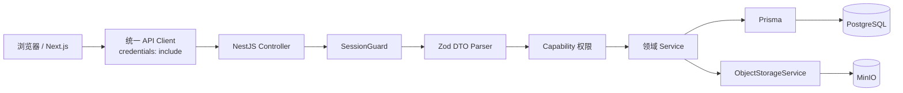
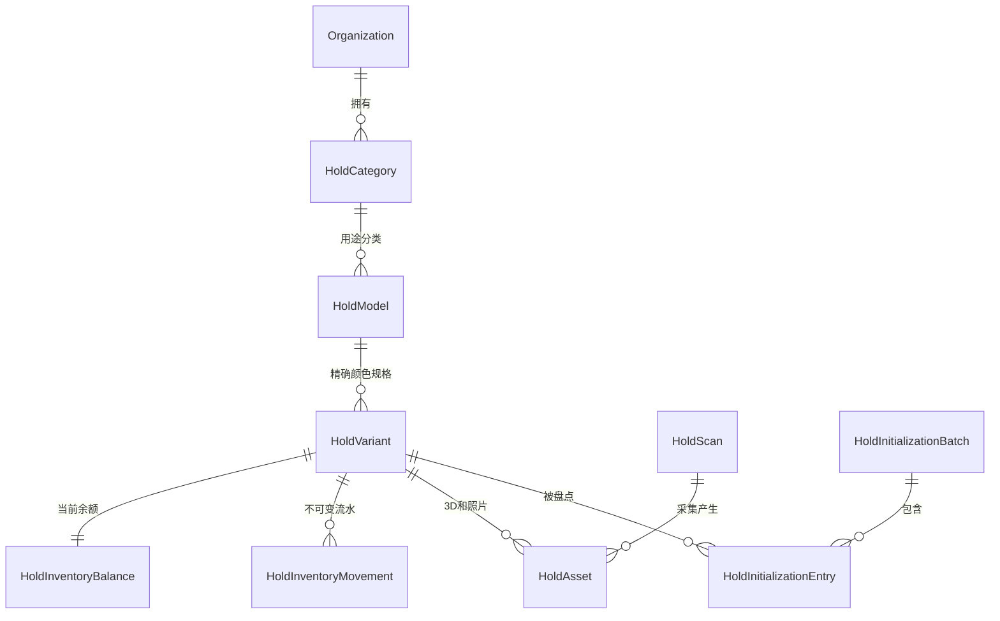

# 模块 3：墙面资产开发交接文档

> **过时文档提示（更新于 2026-08-26）：** 本文只保留作墙面模块历史设计参考，其中“墙面和线路仍为 Dummy 页面”和“下一步继续墙面模块”等内容均已过时。当前产品已收敛为岩点库与线路库，近期开发集中在自动模型清理、物理岩点、RFID 标签和批量盘点。新窗口必须先阅读总交接：`/Users/flacko/Documents/Codex/SummerIntern/poc/docs/POC当前状态与后续开发交接文档.md`；不要从本文的旧开工提示继续开发。

> 交接日期：2026-07-29  
> 目标：让新的 Codex 窗口不依赖旧对话，也能准确理解当前 POC 并安全开始墙面模块。  
> 事实优先级：当前源代码与 Prisma Schema > 本文 > 其他历史说明文档。

## 1. 新窗口先做什么

新窗口开始开发前，按以下顺序读取：

1. 本文；
2. `docs/POC开发环境与技术基线.md`；
3. `docs/岩点模块设计与全栈实现详解.md`；
4. `apps/api/prisma/schema.prisma`；
5. `apps/api/src/holds/hold-inventory.service.ts`；
6. `apps/web/src/features/dashboard/core-page-configs.ts` 与墙面 Dummy 页面。

不要从旧项目 `ClimbingApp` 继续改，也不要另建一个工程。模块 3 的唯一工作目录是：

```text
/Users/flacko/Documents/Codex/SummerIntern/poc
```

可以直接向新窗口下达：

> 请先完整阅读 `docs/模块3墙面开发交接文档.md`，再以当前代码为事实来源开始模块 3。先做墙面业务建模和开发边界确认，不提前开发线路；任何数据库变化必须带 Prisma migration 和测试。

## 2. 项目定位和开发原则

这是一个攀岩馆 SaaS POC，目前聚焦单馆低并发场景，但所有业务数据从一开始按 `organizationId` 做租户隔离。

开发风格仍然遵守：

- 重视快速可演示结果，但影响数据库和跨模块边界时先写短 SPEC；
- 单一职责，函数尽量少于 50 行；
- 业务代码、类型和数据库字段使用英文命名；
- 不把角色、状态、颜色、数量上限、URL 等散落硬编码；
- 异步操作必须处理异常；
- 修改区域顺手消除坏味道，但不借机重写无关模块；
- 不引入当前规模不需要的微服务、Redis 分布式锁、消息队列或 Kubernetes；
- 前端保持现代简约、清晰留白和卡片布局，后端与数据库正确性优先；
- 所有说明文档使用中文，专业术语和代码标识可保留英文。

## 3. 当前技术栈和运行方式

| 层级            | 当前实现                                                       |
| --------------- | -------------------------------------------------------------- |
| Monorepo        | pnpm workspace + Turborepo                                     |
| Web             | Next.js 15 + React + TypeScript                                |
| API             | NestJS 11 + Fastify + TypeScript                               |
| 数据库          | PostgreSQL 17                                                  |
| ORM / Migration | Prisma 6                                                       |
| 对象存储        | MinIO，S3 兼容                                                 |
| 会话            | PostgreSQL `AuthSession` + HttpOnly Cookie                     |
| 限流            | PostgreSQL `RateLimitRecord`；Redis 容器目前没有被业务代码使用 |
| 参数校验        | Zod                                                            |
| API 文档        | NestJS Swagger / OpenAPI                                       |
| 测试            | Vitest                                                         |
| 质量检查        | TypeScript、ESLint、Prettier、生产构建                         |

本地端口：

| 服务          | 地址                             |
| ------------- | -------------------------------- |
| Web           | `http://localhost:3100`          |
| API           | `http://localhost:3101/api`      |
| Swagger       | `http://localhost:3101/api/docs` |
| PostgreSQL    | `localhost:5434`                 |
| Redis         | `localhost:6380`                 |
| MinIO API     | `localhost:9002`                 |
| MinIO Console | `http://localhost:9003`          |

启动命令：

```bash
cd /Users/flacko/Documents/Codex/SummerIntern/poc
export PATH="/opt/homebrew/opt/node@22/bin:$PATH"
node -v
pnpm services:up
pnpm db:migrate
pnpm dev
```

项目要求 Node `22.23.x`、pnpm `11.9.0`。如果 `pnpm dev` 出现莫名编译错误，先检查 `node -v`，不要直接删除依赖或数据库。

常用检查：

```bash
pnpm services:status
pnpm lint
pnpm typecheck
pnpm test
pnpm build
pnpm --filter @climbing-crm/api prisma migrate status
```

如果 `localhost:3100` 拒绝连接，通常只是开发进程没有运行。先确认终端中 `pnpm dev` 仍在运行，再检查端口：

```bash
lsof -nP -iTCP:3100 -sTCP:LISTEN
lsof -nP -iTCP:3101 -sTCP:LISTEN
```

不要直接结束不明进程；优先回到原开发终端按 `Control-C` 后重新启动。

## 4. 当前目录结构

以下只列源代码和配置，不包含 `node_modules`、`.next-*`、`dist`、`.turbo` 等生成产物：

```text
poc/
├── apps/
│   ├── api/
│   │   ├── prisma/
│   │   │   ├── schema.prisma
│   │   │   └── migrations/             # 当前共 12 个迁移
│   │   └── src/
│   │       ├── auth/                   # 注册、登录、会话、邀请接受
│   │       ├── common/                 # 审计、关联 ID、安全异常输出
│   │       ├── config/                 # 环境变量校验
│   │       ├── database/               # PrismaService、数据库错误映射
│   │       ├── holds/                  # 岩点分类、档案、库存、扫描、3D、初始化
│   │       ├── security/               # Capability、Token、限流
│   │       ├── storage/                # 当前单 bucket MinIO 封装
│   │       ├── team/                   # 员工邀请和管理
│   │       ├── app.module.ts
│   │       └── main.ts
│   └── web/
│       └── src/
│           ├── app/
│           │   ├── dashboard/
│           │   │   ├── assets/holds/  # 已完成的岩点页面
│           │   │   ├── assets/walls/  # 当前为 Dummy，模块 3 从这里替换
│           │   │   ├── assets/routes/ # Dummy，本模块不要开发
│           │   │   └── dashboard.css  # 3261 行旧全局样式，不继续堆墙面样式
│           │   ├── invite/
│           │   └── page.tsx            # 登录注册入口
│           ├── features/
│           │   ├── auth/
│           │   ├── common/
│           │   ├── dashboard/
│           │   ├── holds/
│           │   └── team/
│           └── lib/                    # API Client、服务端 Session
├── docs/
├── infra/compose.yaml
├── packages/config/
├── .env.example
├── package.json
├── pnpm-workspace.yaml
└── turbo.json
```

建议模块 3 新增独立目录：

```text
apps/api/src/walls/
├── wall.controller.ts
├── wall.dto.ts
├── wall.service.ts
├── wall-version.service.ts             # 确认需要版本模型后再创建
├── wall-asset.service.ts               # 确认墙面媒体范围后再创建
└── *.spec.ts

apps/web/src/features/walls/
├── walls-management-page.tsx
├── wall-api.ts
├── use-walls-data.ts
├── wall-form.tsx
├── wall-detail-panel.tsx
└── walls.module.css                    # 优先 CSS Module，避免继续扩大 dashboard.css
```

## 5. 系统架构



请求处理原则：

1. 浏览器只提交业务参数，不提交可信的 `organizationId` 或角色；
2. `SessionGuard` 从 HttpOnly Cookie 恢复账号、Membership、组织和角色；
3. Controller 只处理路由、参数和文件入口；
4. Zod 校验格式，Capability 校验权限；
5. Service 负责租户过滤、业务状态机和事务；
6. PostgreSQL 保存关系数据、审计和对象元数据；
7. MinIO 保存二进制文件，数据库不存图片或 3D 文件本体。

## 6. 目前已经完成的模块

### 6.1 模块 1：认证

- 首页先登录，没有账号再注册；
- 邮箱 + 密码；
- 注册时创建岩馆 `Organization` 和 L1 管理员；
- 会话保存在 PostgreSQL，浏览器使用 HttpOnly Cookie；
- 登录后进入 `/dashboard`；
- 已实现退出登录、会话失效和安全错误输出。

### 6.2 模块 2.1：数字化看板骨架

- 固定左侧导航和移动端适配；
- 员工管理、资产管理下的岩点 / 墙面 / 线路入口；
- 日程、营销、数据、设置只做 Dummy；
- 墙面和线路页面目前也只是配置驱动的 Dummy 展示。

### 6.3 模块 2.2：员工管理

- L1 通过邮箱邀请 L2；
- 邀请查看、重发、撤销和接受；
- L1 管理员工展示名、岗位、职责和状态；
- 当前数据按 `organizationId` 隔离；
- L2 可查看员工目录，只有 L1 可管理。

### 6.4 模块 2.3：岩点资产

已实现：

- 用途分类：Jug、Crimp、Sloper、Pinch、Pocket、Foothold、Volume、Other；
- 手工或扫描创建统一岩点档案；
- 产品型号与精确颜色规格分层；
- 同一个肉眼颜色名允许不同 Hex 色阶，例如两个“黄色”；
- 仓库、已上墙、预留、维护四个聚合库存分区；
- 正常入库、现场校准、初始化盘点、撤销入库；
- 停用、恢复、用户视角永久删除及审计快照；
- GLB 主模型、照片、WebP 俯瞰缩略图；
- 卡片先加载缩略图，点击后加载完整 3D 并支持拖动旋转；
- 分类与档案搜索筛选；
- 全馆初始化批次；
- 数据库约束、幂等请求、乐观版本和岩馆级短事务锁。

最后一次完整验证结果：

- API：52 项测试通过；
- Web：12 项测试通过；
- TypeScript、ESLint、Prettier 通过；
- API 与 Web 生产构建通过；
- 本地 PostgreSQL 已应用 12 个迁移，最后一个为 `20260728103000_scope_inventory_request_keys`。

进入模块 3 前可以重新执行验证命令确认本机状态。文档不能代替当前机器上的实际检查结果。

## 7. 当前数据库核心结构

### 7.1 身份和租户

```text
Organization
├── Membership ── Account
├── StaffInvitation
├── AuthSession（通过 Membership 间接归属组织）
└── AuditEvent
```

角色：

- `L1_ADMIN`：老板 / 管理员，拥有全部当前 Capability；
- `L2_ADMIN`：员工，可读、建档、上传、正常入库，但不能库存校准、停用或删除。

已有资产相关 Capability：

| Capability          | L1  | L2  | 模块 3 建议用途    |
| ------------------- | --- | --- | ------------------ |
| `ASSET_READ`        | 是  | 是  | 查看墙面           |
| `ASSET_DRAFT_WRITE` | 是  | 是  | 新建和编辑墙面草稿 |
| `ASSET_PUBLISH`     | 是  | 否  | 发布墙面版本       |

墙面模块优先复用这三个 Capability。只有出现无法表达的新权限差异时，才新增 `WALL_*`，不要在组件或 Service 中直接判断角色字符串。

### 7.2 岩点聚合



关键定义：

- `HoldModel`：厂商、造型、尺寸等级、固定方式、物理尺寸相同的产品型号；
- `HoldVariant`：型号下的精确颜色 / SKU 档案，是库存记账最小单位；
- 普通岩点不逐颗建实体，完全相同的一批岩点以数量管理；
- 未来只有“墙面上的安装位置”需要逐条记录；
- 墙面和线路必须引用 `HoldVariant.id`，不能复制一套岩点资料。

四个库存分区：

| 分区          | 含义                     |
| ------------- | ------------------------ |
| `WAREHOUSE`   | 仓库可用                 |
| `INSTALLED`   | 已安装在墙面上的聚合数量 |
| `RESERVED`    | 为换线预留               |
| `MAINTENANCE` | 清洗、维修或待检查       |

## 8. 已完成的库存安全边界

### 8.1 余额和流水

`HoldInventoryBalance` 用于快速读取当前值，`HoldInventoryMovement` 用于解释每次变化。余额、流水和审计在同一事务提交。

库存余额使用 `version` 乐观锁；到货和调整请求使用 UUID `requestKey` 做岩馆内幂等。网络超时后用同一请求键重试，不会重复入库。

### 8.2 岩馆级短事务锁

关键写操作调用：

```text
apps/api/src/holds/hold-transaction-lock.ts
```

它使用 PostgreSQL transaction-level advisory lock，把同一岩馆内的短写事务串行化，不同岩馆互不影响。墙面安装、下墙和换线会改变岩点库存，因此必须与该锁使用同一个组织级锁策略。

不要在用户打开编辑页时持锁，也不要把上传文件过程放进数据库锁；只在最终提交的短事务内加锁。

### 8.3 已预留的库存转移方法

`HoldInventoryService.transfer(session, input)` 当前支持：

```ts
interface HoldInventoryTransferInput {
  variantId: string;
  from: 'WAREHOUSE' | 'INSTALLED';
  to: 'WAREHOUSE' | 'INSTALLED';
  quantity: number;
  requestKey: string;
  referenceType: 'WALL_PLACEMENT' | 'ROUTE_ASSIGNMENT';
  referenceId: string;
  note?: string;
}
```

它会在一个事务里更新两个库存分区、增加一次余额版本、追加两条流水并写审计。

但是有一个模块 3 开工前必须处理的边界：该方法当前自己开启 Prisma 事务。墙面服务如果先创建安装记录、再调用 `transfer()`，安装记录与库存仍是两个事务。

正确改造方向二选一：

1. 在库存领域增加 `transferWithinTransaction(transaction, session, input)`，由墙面 Service 统一开启事务和组织锁；
2. 或创建更高层的安装命令服务，由它在同一事务中创建 / 删除墙面安装记录并调用库存内部写入函数。

无论选择哪一种，最终必须保证：

```text
墙面安装记录 + 库存余额 + 两条库存流水 + 审计事件
要么全部提交，要么全部回滚
```

不要通过前端连续调用“仓库减一”和“已上墙加一”，也不要在两个 HTTP 请求之间维持业务一致性。

## 9. 模块 3 的当前真实状态

当前墙面页面：

```text
apps/web/src/app/dashboard/assets/walls/page.tsx
```

它仅渲染：

```text
wallPageConfig → CoreManagementPage
```

Dummy 数据位于：

```text
apps/web/src/features/dashboard/core-page-configs.ts
```

现状：

- “新增墙面”按钮是禁用的；
- 表格、统计数据和工作流均为硬编码演示；
- Prisma 中没有 Wall 表；
- API 中没有 `walls` 目录、Controller 或 Service；
- 前端没有 `features/walls`；
- 没有墙面图片 / 3D 的独立 bucket 配置；
- 没有墙面安装点位数据；
- 没有墙面版本状态机；
- 线路页面也仍为 Dummy，不属于本阶段实施范围。

模块 3 应替换墙面 Dummy，但保持看板壳、导航、登录态和现有视觉变量不变。

## 10. 模块 3 开发前需要形成的短 SPEC

以下问题会直接影响数据库，不能边写页面边临时决定：

1. 用户说的“一面墙”是稳定物理资产、可拆换板块，还是一个连续区域？
2. POC 第一版采用二维平面坐标、规则网格，还是允许任意坐标？
3. 是否需要记录墙面角度、宽高、区域、朝向和安全区？
4. 墙面媒体第一版是基准照片、示意图、GLB，还是三者都有？
5. 墙面资料修改是直接覆盖，还是通过 Draft / Published 版本发布？
6. 已有 `INSTALLED` 聚合库存如何对应到具体墙面？
7. 模块 3A 是否只做墙面档案与版本，模块 3B 再做岩点安装位置？
8. 删除墙面、停用墙面、退役墙面分别对历史线路和岩点安装产生什么效果？

推荐拆成两个可演示切片：

### 10.1 模块 3A：墙面档案与空间基线

- 墙面 CRUD；
- 区域、编号、名称、宽高、角度、描述；
- 状态和权限；
- 基准照片或示意资产；
- 如果确定需要版本，再实现 Draft / Published / Retired；
- 暂不改变岩点库存。

### 10.2 模块 3B：墙面点位与岩点安装

- 在有效墙面版本上创建安装位置；
- 安装位置引用 `HoldVariant.id`；
- 上墙时 `WAREHOUSE → INSTALLED`；
- 下墙时 `INSTALLED → WAREHOUSE`；
- 安装记录和库存转移同事务；
- 为后续线路模块保留引用，不提前实现路线编排。

这种拆分可以避免墙面基础资料、坐标系统、库存迁移和线路规则一次性耦合。

## 11. 推荐的数据模型起点（提案，不是已实现事实）

在短 SPEC 确认后，可从以下最小模型裁剪，不要一次把所有字段都建出来。

```text
Wall
├── 稳定物理身份：organizationId、code、name、area、status
├── 当前版本引用（可选）
└── WallVersion[]

WallVersion
├── versionNumber
├── DRAFT / PUBLISHED / RETIRED
├── widthMm、heightMm、angleDegrees
├── coordinateSystem / grid metadata
├── WallAsset[]
└── WallHoldPlacement[]

WallAsset
├── kind
├── objectKey、contentType、checksum、sizeBytes
└── status

WallHoldPlacement
├── wallVersionId
├── holdVariantId
├── x、y，以及确认需要后再增加 z / rotation
├── requestKey
├── installedByAccountId、installedAt
└── removedAt
```

设计原则：

- `Wall` 是长期身份，尺寸或媒体变化不应强迫历史线路改绑另一面墙；
- 只有确实需要保留历史配置时才引入 `WallVersion`；
- `WallHoldPlacement` 表示安装事实，不等于为仓库每一颗岩点建立实体；
- 颜色、模型、厂商等继续从 `HoldVariant` 关联读取；
- 所有表包含或可可靠推导 `organizationId`，查询必须使用会话组织过滤；
- 外键默认 `ON DELETE RESTRICT`，历史数据不做级联删除；
- 状态、数量和坐标范围需要数据库 Check Constraint；
- 唯一编号至少按 `(organizationId, code)` 约束；
- 如果存在活动版本，约束同一墙面最多一个 Published / Active 版本；
- 幂等键按组织隔离，网络重试不得重复安装。

## 12. 已上墙历史库存的迁移问题

岩点模块已经允许初始化 `installedQuantity`，但当前不知道这些岩点在哪一面墙。模块 3 不能假设现有已上墙数量都可再次从仓库扣除。

建议定义：

```text
未分配已上墙数量
= HoldInventoryBalance.installedQuantity
- 当前有效 WallHoldPlacement 中该 HoldVariant 的数量
```

录入现有墙面基线时：

- 从“未分配已上墙数量”认领安装记录，不再次修改余额；
- 认领数量不能超过未分配数量；
- 新增真实上墙操作才执行 `WAREHOUSE → INSTALLED`；
- 正常下墙执行 `INSTALLED → WAREHOUSE`；
- 如果现场发现总数不符，走 L1 库存校准并填写原因，不偷偷修正。

这套方案需要在 3B SPEC 中明确并增加测试。3A 如果不做安装点位，可以暂时不处理该问题。

## 13. 墙面对象存储边界

历史技术基线要求墙面使用独立 bucket，但当前 `ObjectStorageService` 只支持环境变量 `MINIO_BUCKET` 指定的单个岩点 bucket。

模块 3 如果上传墙面媒体，应先选择一种清晰方案：

- 将对象存储封装重构为显式 bucket 参数，并通过 allowlist 限制；或
- 新建 `WallObjectStorageService` 和 `WALL_MINIO_BUCKET` 环境变量。

不要把 bucket 名称散落在 Controller / Service 中，也不要让前端传 bucket。对象键建议：

```text
{organizationId}/walls/{wallId}/versions/{versionId}/{uuid}.{extension}
```

墙面上传需要复用岩点模块已经验证过的安全原则：

- 文件名净化；
- 文件大小上限；
- 根据真实文件签名决定 MIME，不信任浏览器声明；
- 数据库只保存对象键和元数据；
- 数据库失败后补偿清理对象；
- 删除先改变数据库可见状态，再尽力清理 MinIO；
- 不把 MinIO 凭据暴露给浏览器。

## 14. 前端接入边界

保留以下现有设施：

- `DashboardShell`、侧边导航和移动端行为；
- `PageHeading`、`SectionCard`、统计卡等通用组件；
- `apps/web/src/lib/api.ts` 的 Cookie、JSON、FormData 和错误解析方式；
- 当前 CSS 变量和整体视觉风格。

模块 3 不应：

- 继续把大量 `.wall-*` 样式追加进 3261 行的 `dashboard.css`；
- 在页面组件中直接写 `fetch`；
- 复制一份岩点类型或库存余额到前端墙面状态；
- 用 hover 自动加载大型 3D；
- 在 UI 隐藏按钮后就认为完成权限控制。

如果墙面需要 3D，沿用岩点已经确认的交互：卡片展示轻量缩略图，用户点击后才加载完整模型，在弹层中拖动查看；不要加入 hover 放大或 hover 加载。

## 15. 推荐 API 形状（待 SPEC 确认）

基础墙面档案可以从以下 REST 结构开始：

```text
GET    /api/walls
POST   /api/walls
GET    /api/walls/:wallId
PATCH  /api/walls/:wallId
POST   /api/walls/:wallId/stop
POST   /api/walls/:wallId/restore
```

如果采用版本：

```text
POST   /api/walls/:wallId/versions
PATCH  /api/walls/:wallId/versions/:versionId
POST   /api/walls/:wallId/versions/:versionId/publish
POST   /api/walls/:wallId/versions/:versionId/assets
GET    /api/walls/assets/:assetId/content
```

如果 3B 做安装点位：

```text
POST   /api/walls/:wallId/versions/:versionId/placements
PATCH  /api/walls/:wallId/versions/:versionId/placements/:placementId
DELETE /api/walls/:wallId/versions/:versionId/placements/:placementId
```

Controller 只接收参数；创建安装和库存转移必须由一个应用服务在同一事务完成。

## 16. 模块 3 推荐实施顺序

1. 阅读本文和现有岩点核心代码；
2. 写 `docs/module-03-wall-management-spec.md`，确认第 10 节的问题；
3. 先设计 Prisma 模型、状态机、唯一约束和删除策略；
4. 新增 migration，不手改已应用的 12 个旧 migration；
5. 增加 `ASSET_*` Capability 的墙面用例测试；
6. 实现墙面 DTO、Mapper、Service、Controller；
7. 增加租户隔离、唯一编号、状态冲突和并发测试；
8. 替换 `/dashboard/assets/walls` Dummy；
9. 如果 3A 包含媒体，再扩展独立墙面对象存储；
10. 如果 3B 包含安装，先解决库存事务可组合边界；
11. 执行 migration、test、typecheck、lint、format、build；
12. 在浏览器验证 L1 / L2 权限和移动端布局。

## 17. 模块 3 最小验收清单

### 17.1 数据与安全

- 当前岩馆只能读取自己的墙面；
- 前端伪造组织 ID 无效；
- 同一岩馆墙面编号唯一；
- 停用 / 发布状态由数据库和 Service 双重保护；
- 有历史引用的墙面不能物理删除；
- 所有写操作有 AuditEvent；
- 数据库结构变化有 migration；
- 异步异常不会留下页面显示成功但数据库半完成的状态。

### 17.2 工程质量

- Controller 无业务逻辑；
- DTO、Service、Mapper、存储职责分开；
- 不把墙面代码塞进 `holds` 目录；
- 不复制库存计算；
- 不继续扩大 Dashboard Dummy 配置承担真实业务；
- 关键函数尽量少于 50 行；
- 至少包含 DTO、Service 和关键事务测试。

### 17.3 用户体验

- 用户能快速创建、搜索和定位墙面；
- 表单使用现实中的词，不展示数据库术语；
- 删除、停用、发布的差异清楚；
- 危险操作有明确后果提示；
- 大文件按需加载；
- 页面空状态、加载、错误和成功反馈完整。

## 18. 已知工程债务与注意事项

1. `poc` 目录当前没有独立 `.git`；检测到的 Git 仓库是旧项目 `ClimbingApp`。开始较大模块前应确认是否为 `poc` 初始化独立仓库，避免失去可靠回退点。
2. `dashboard.css` 当前 3261 行。模块 3 新样式应隔离，旧样式拆分可另开纯重构任务，不要和墙面业务迁移混在一起。
3. 前后端 API 类型目前各自维护，没有真正建立 `packages/api-contract`。模块 3 可保持现有模式，不要为了一个模块先做全仓生成器重构；但字段变化必须同步两端测试。
4. Redis 容器已存在但当前会话和限流仍使用 PostgreSQL。不要因为 Redis 在 Compose 中就默认业务已接入。
5. `ObjectStorageService` 当前只有一个 bucket，是墙面媒体开发前必须明确的边界。
6. `HoldInventoryMovement.referenceType/referenceId` 是多态字符串，没有墙面外键。3B 应评估增加显式 `wallPlacementId` 外键，或由统一库存操作表维护强引用；仅靠字符串无法由数据库阻止悬空引用。
7. 当前组织级 lock helper 位于 `holds` 目录。墙面接入库存时可将其重命名并迁移到通用资产事务目录，但必须保持同一锁键算法，不要各模块创建互不相识的锁。
8. 历史文档可能保留早期方案。遇到冲突时以当前 Schema、Service 和 migration 为准，并顺手更新文档。

## 19. 不要做的事情

- 不修改旧项目 `/Users/flacko/Documents/Codex/SummerIntern/ClimbingApp`；
- 不删除或重写已经应用的 migration；
- 不把墙面和线路一次性开发；
- 不为仓库中每颗普通岩点创建实体；
- 不在前端直接修改库存数字；
- 不绕过 `Capability`；
- 不把 `organizationId` 当作可信请求参数；
- 不在长时间用户编辑过程中持有数据库锁；
- 不为低并发 POC 引入复杂分布式基础设施；
- 不为了“统一”而大范围重写已经通过测试的岩点模块。

完成以上交接后，新窗口可以先就第 10 节输出模块 3A 的短 SPEC 和数据库草图，经确认后开始实现。
